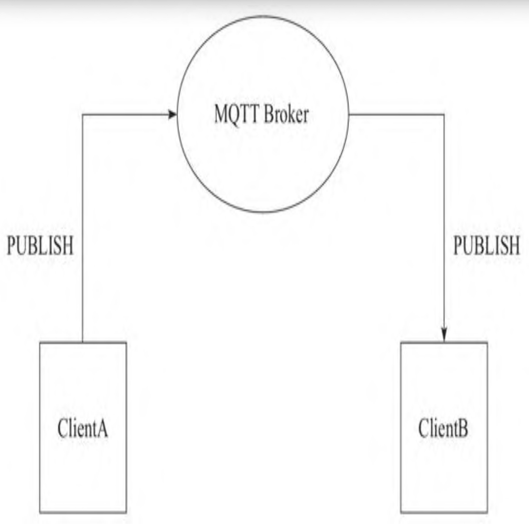

## 发布者 （Publisher） / 订阅者（Subscriber）
Publisher和Subscriber是相对于Topic来说的身份。
+ 如果一个 Client向某个Topic发布消息，那么它就是Publisher
+ 如果一个 Client订阅了某个Topic，那么它就是Subscriber
## 发送方（Sender）/ 接收方 （Receiver）
Sender和Receiver是相对于消息传输方向的身份。
+ 当ClientA发布消息时，它给Broker发送一条消息，那么ClientA是 Sender，Broker是Receiver；
+ 当Broker转发消息给ClientB时，Broker是Sender，ClientB则是 Receiver。

## QoS (Quality of Service)
QoS是消息传输的保序性，QoS有三种级别：
+ QoS0：At most once，至多一次。表示Sender发送一条消息，Receiver最多能收到一次，也就是说Sender尽力向Receiver发送消息，如果发送失败，则放弃。
+ QoS1：At least once，至少一次。表示Sender发送一条消息，Receiver至少能收到一次，也就是说Sender向Receiver发送消息，如果发送失败，Sender会继续重试，直到Receiver收到消息为止，但是因为重传的原因，Receiver可能会收到重复的消息。
+ QoS2：Exactly once，确保只有一次。表示Sender发送一条消息，Receiver确保能收到且只收到一次，也就是说Sender尽力向Receiver发送消息，如果发送失败，会继续重试，直到Receiver收到消息为止，同时保证Receiver不会因为消息重传而收到重复的消息
> 注意，QoS是Sender和Receiver之间达成的协议，不是Publisher和Subscriber之间达成的协议。也就是说，Publisher发布一条QoS1的消息，只能保证Broker至少收到一次；而对应的Subscriber能否至少收到一次这个消息，还要取决于Subscriber在Subscribe的时候和Broker协商的QoS等级。

MQTT协议中，从Broker到Subscriber这段消息传递的实际QoS等级等于Publisher发布消息时指定的QoS等级和Subscriber在订阅时与Broker协商的QoS等级中最小的那一个。
~~~text
Actual Subscribe QoS=MIN(Publish QoS,Subscribe QoS)
~~~

## 如何选择QoS
+ QoS0：
  + Client和Broker之间的网络连接非常稳定，例如一个通过有线网络连接到Broker的测试用Client；
  + 可以接受丢失部分消息，比如一个传感器以非常短的间隔发布状态数据，那丢失一些数据也可以接受；
  + 不需要离线消息。
+ QoS1
  + 应用需要接收所有的消息，而且可以接受并处理重复的消息
  + 无法接受QoS2带来的额外开销，QoS1发送消息的速度比QoS2快很多
+ QoS2
  + 应用必须接收所有的消息，而且应用在重复的消息下无法正常工作，同时你可以接受QoS2带来的额外开销

# Retained消息
+ 一个Topic只能有一条Retained消息，发布新的Retained消息将覆盖旧的Retained消息
+ 只有新的订阅者才会收到Retained消息，如果订阅者重复订阅一个主题，那么在每次订阅的时候都会被当作新的订阅者，然后收到Retained消息
+ 当Retained消息发送到订阅者时，PUBLISH数据包中Retain的标识仍然是1。订阅者可以判断这个消息是否是Retained消息，以做出相应的处理。

> **Retained消息和持久会话没有任何关系。Retained消息是Broker为每一个主题单独存储的，而持久会话是Broker为每一个Client单独存储的**

